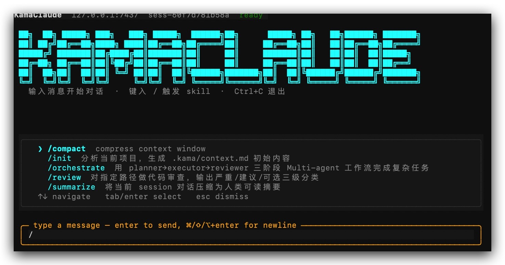

# TackleClaude

TackleClaude 是一个本地运行的 AI Agent 系统（mini 版），参考了 Claude Code 的核心设计，实现了 Agent 自主规划、工具调用、权限审批、事件流、上下文治理和外部扩展等完整链路。

## 效果展示

（接入 deepseek-v4-flash 模型，可切换其他模型）

支持命令执行、skill 使用、上下文控制与压缩：

复杂任务自动规划与执行（执行前申请本地编辑权限）：

规划与执行过程：

## 核心机制

TackleClaude 将 Claude Code 这类 AI 编程 Agent 的核心运行机制抽取并实现如下：

- 用户输入目标，Agent 自主规划下一步
- 模型主动发起工具调用
- 工具调用包含参数校验和权限审批
- 执行过程通过事件流实时展示到 TUI
- 每次运行留下 events、trace、session 记录，可复盘排查
- 多轮会话使用 thread、notes、context 分层记忆
- 上下文存在水位检测和 compact 压缩
- 复杂任务可分配给子 Agent，外部工具通过 MCP 接入

## TackleClaude 长什么样？

TackleClaude 的最终形态：

用户通过 `kama` CLI 或 `kama-tui` 连接到常驻的 `kama-core` 守护进程。执行任务的主体是 Core daemon，CLI 和 TUI 作为客户端。此架构带来以下特性：

- TUI 崩溃后 Agent 任务仍可继续运行
- 可同时接入 CLI、TUI、Web 前端
- 所有任务过程支持事件流订阅
- 命令、响应、事件通过类型化协议通信
- 工具调用、会话记忆、权限审批、上下文压缩在同一链路中完成

## 项目架构

TackleClaude 的核心是一套完整的本地 Agent 运行链路：
用户目标
→ CLI / TUI
→ JSON-RPC over NDJSON
→ kama-core daemon
→ AgentRunner
→ AgentLoop
→ LLM Provider
→ ToolRegistry
→ PermissionManager
→ EventBus
→ Session Store
→ TUI 实时渲染 / events.jsonl 持久化 / trace 回放

## 项目亮点

TackleClaude 将 AI 编程 Agent 背后的核心机制在 mini 工程中完整实现。

- 采用 `kama-core` daemon + CLI/TUI 多客户端架构
- 实现 ReAct AgentLoop，支持模型思考、工具调用、结果回填和多步执行
- 通过 `ToolRegistry` 和 `PermissionManager` 进行参数校验、权限审批、失败分类，再将工具结果返回模型
- 借助 `EventBus`、events、trace 和 TUI 实时展示 token 流、工具调用、审批、上下文水位，并支持回放
- 使用 session、thread、notes、context 和 compact 治理长会话上下文
- 支持 Skills、Subagents、MCP，统一接入工作流、子 Agent 和外部工具

TackleClaude 实现了一个本地 Agent 运行时，其工程主线为：用户目标 → Agent Loop → 模型思考 → 工具调用 → 结果回填 → 事件展示 → 会话续航。
